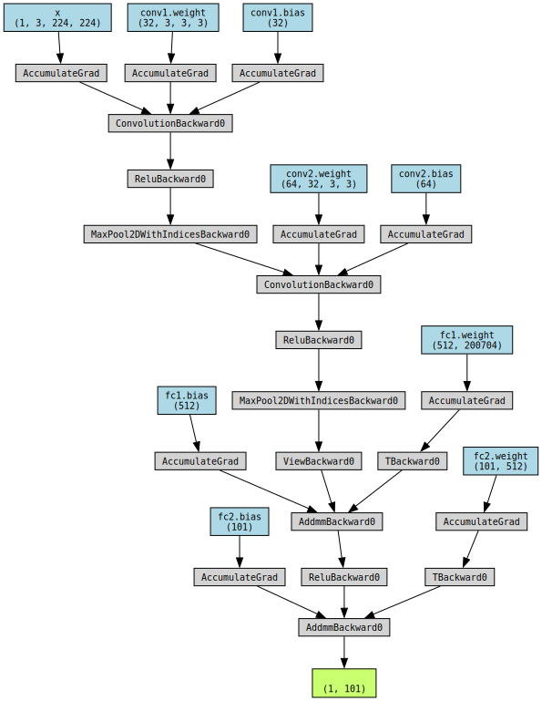

# Data Augmentation and Visualization with PyTorch and Caltech101

In this notebook, we will demonstrate how to perform data augmentation using PyTorch's `torchvision` package, and how to visualize a batch of images from a DataLoader. We'll use the Caltech101 dataset for this tutorial.

## Loading the Dataset


```python
# Importiere die Bibliotheken
import torchvision as tv
import torch as tc
import matplotlib.pyplot as plt
import numpy as np
import torch.nn as nn
import torch.nn.functional as F
from torchsummary import summary
from torchviz import make_dot
from torch.utils.data import random_split
from tqdm import tqdm


# Datensatz von Caltech101 herunterladen (https://data.caltech.edu/records/mzrjq-6wc02)
caltech_data = tv.datasets.Caltech101(root='./training_data', download=True)

# Print the number of samples in the dataset
print(f'Number of samples in the dataset: {len(caltech_data)}')

```

    Files already downloaded and verified
    Number of samples in the dataset: 8677


## Applying Data Augmentation

Next, we'll define a set of transforms to augment our data. These include randomly flipping the image horizontally, rotating the image by 10 degrees, converting the image to a PyTorch Tensor, and normalizing the image.

Then, we'll apply these transformations to our dataset.


```python

# Define a transform to augment the data
transform = tv.transforms.Compose([
    tv.transforms.Lambda(lambda x: x.convert("RGB") if x.mode == 'L' else x),  # convert grayscale to RGB
    tv.transforms.Resize((256, 256)),  # resize images to larger than the final size
    tv.transforms.RandomHorizontalFlip(),  # randomly flip image horizontally
    tv.transforms.RandomRotation(10),  # randomly rotate image by 10 degrees
    tv.transforms.CenterCrop(224),  # crop the center of the image after rotation
    tv.transforms.ToTensor(),  # convert the image to a PyTorch Tensor
    tv.transforms.Normalize((0.5, 0.5, 0.5), (0.5, 0.5, 0.5))  # normalize the image
])

# Apply the transform to the dataset
caltech_data.transform = transform

```

## Creating a DataLoader

After the transformations are defined and applied, we create a `DataLoader`


```python
# Split the dataset into training and validation sets
train_size = int(0.8 * len(caltech_data))
val_size = len(caltech_data) - train_size
train_dataset, val_dataset = random_split(caltech_data, [train_size, val_size])

# Create data loaders for the training and validation sets
train_loader = tc.utils.data.DataLoader(train_dataset, batch_size=64, shuffle=True)
val_loader = tc.utils.data.DataLoader(val_dataset, batch_size=64, shuffle=False)
```

## Visualizing a Batch of Images

Finally, let's visualize a batch of images from our DataLoader. We'll define a helper function to unnormalize and display an image, then use it to display a grid of images.


```python

def imshow(img):
    img = img / 2 + 0.5  # unnormalize
    npimg = img.numpy()
    plt.imshow(np.transpose(npimg, (1, 2, 0)))
    plt.show()

# Get a batch of training data
images, labels = next(iter(train_loader))

# Show images
imshow(tv.utils.make_grid(images))

```


    

    


```python

class SimpleCNN(nn.Module):
    def __init__(self):
        super().__init__()
        self.conv1 = nn.Conv2d(3, 32, kernel_size=3, stride=1, padding=1)
        self.pool = nn.MaxPool2d(kernel_size=2, stride=2)
        self.conv2 = nn.Conv2d(32, 64, kernel_size=3, stride=1, padding=1)
        self.fc1 = nn.Linear(64 * 56 * 56, 512)
        self.fc2 = nn.Linear(512, 101)

    def forward(self, x):
        x = self.pool(F.relu(self.conv1(x)))
        x = self.pool(F.relu(self.conv2(x)))
        x = x.view(-1, 64 * 56 * 56)
        x = F.relu(self.fc1(x))
        x = self.fc2(x)
        return x

    def training_step(self, batch, batch_idx):
        images, labels = batch
        outputs = self(images)
        loss = F.cross_entropy(outputs, labels)
        self.log('train_loss', loss)
        return loss

    def validation_step(self, batch, batch_idx):
        images, labels = batch
        outputs = self(images)
        loss = F.cross_entropy(outputs, labels)
        self.log('val_loss', loss)
        return loss

    def configure_optimizers(self):
        optimizer = tc.optim.Adam(self.parameters(), lr=0.001)
        return optimizer

# Create an instance of the Lightning module
model = SimpleCNN()

```


```python
summary(model, input_size=(3, 224, 224))

```

    ----------------------------------------------------------------
            Layer (type)               Output Shape         Param #
    ================================================================
                Conv2d-1         [-1, 32, 224, 224]             896
             MaxPool2d-2         [-1, 32, 112, 112]               0
                Conv2d-3         [-1, 64, 112, 112]          18,496
             MaxPool2d-4           [-1, 64, 56, 56]               0
                Linear-5                  [-1, 512]     102,760,960
                Linear-6                  [-1, 101]          51,813
    ================================================================
    Total params: 102,832,165
    Trainable params: 102,832,165
    Non-trainable params: 0
    ----------------------------------------------------------------
    Input size (MB): 0.57
    Forward/backward pass size (MB): 22.97
    Params size (MB): 392.27
    Estimated Total Size (MB): 415.82
    ----------------------------------------------------------------


```python
x = tc.randn(1, 3, 224, 224).requires_grad_(True)
y = model(x)
make_dot(y, params=dict(list(model.named_parameters()) + [('x', x)]))

```


    

    


```python

# Define the loss function
loss_function = nn.CrossEntropyLoss()

# Define the optimizer (e.g., Adam optimizer)
optimizer = tc.optim.Adam(model.parameters(), lr=0.001)

# Number of epochs to train for
num_epochs = 10

# Lists to store accuracy and loss values
train_accuracy_list = []
train_loss_list = []

```


```python
# Training loop
for epoch in range(num_epochs):
    # Initialize progress bar
    pbar = tqdm(train_loader, desc=f"Epoch {epoch + 1}/{num_epochs}", ncols=80)
    
    # Initialize variables for accuracy and loss
    total_correct = 0
    total_loss = 0
    total_samples = 0

    # Iterate over batches
    for images, labels in pbar:
        # Move tensors to the device
        images = images.to()
        labels = labels.to()

        # Forward pass
        outputs = model(images)
        loss = loss_function(outputs, labels)
        
        # Backward pass and optimization
        optimizer.zero_grad()
        loss.backward()
        optimizer.step()

        # Calculate accuracy
        _, predicted = tc.max(outputs.data, 1)
        total_samples += labels.size(0)
        total_correct += (predicted == labels).sum().item()

        # Update progress bar description
        pbar.set_postfix({"Loss": loss.item()})

        # Store accuracy and loss values
        train_accuracy_list.append(total_correct / total_samples)
        train_loss_list.append(loss.item())

```

    Epoch 1/10: 100%|██████████████████| 109/109 [03:05<00:00,  1.71s/it, Loss=3.84]
    Epoch 2/10: 100%|██████████████████| 109/109 [03:08<00:00,  1.73s/it, Loss=3.07]
    Epoch 3/10: 100%|███████████████████| 109/109 [03:37<00:00,  2.00s/it, Loss=2.6]
    Epoch 4/10: 100%|██████████████████| 109/109 [03:58<00:00,  2.19s/it, Loss=2.02]
    Epoch 5/10: 100%|██████████████████| 109/109 [04:47<00:00,  2.64s/it, Loss=1.59]
    Epoch 6/10: 100%|██████████████████| 109/109 [05:35<00:00,  3.08s/it, Loss=1.59]
    Epoch 7/10: 100%|██████████████████| 109/109 [04:36<00:00,  2.54s/it, Loss=2.79]
    Epoch 8/10: 100%|██████████████████| 109/109 [03:57<00:00,  2.18s/it, Loss=1.16]
    Epoch 9/10: 100%|█████████████████| 109/109 [03:39<00:00,  2.02s/it, Loss=0.845]
    Epoch 10/10: 100%|████████████████| 109/109 [03:43<00:00,  2.05s/it, Loss=0.774]


```python
# Plot accuracy and loss values
plt.figure(figsize=(10, 4))
plt.subplot(1, 2, 1)
plt.plot(train_accuracy_list)
plt.title("Training Accuracy")
plt.xlabel("Batch")
plt.ylabel("Accuracy")
plt.subplot(1, 2, 2)
plt.plot(train_loss_list)
plt.title("Training Loss")
plt.xlabel("Batch")
plt.ylabel("Loss")
plt.tight_layout()
plt.show()

```


    

    


```python
# Set the model to evaluation mode
model.eval()

# Lists to store accuracy and loss values
val_accuracy_list = []
val_loss_list = []

# Disable gradients for validation
with tc.no_grad():
    for images, labels in val_loader:
        # Move tensors to the device
        images = images.to()
        labels = labels.to()

        # Forward pass
        outputs = model(images)
        loss = loss_function(outputs, labels)

        # Calculate accuracy
        _, predicted = tc.max(outputs.data, 1)
        correct = (predicted == labels).sum().item()
        accuracy = correct / len(labels)

        # Store accuracy and loss values
        val_accuracy_list.append(accuracy)
        val_loss_list.append(loss.item())

# Calculate the average accuracy and loss for the validation dataset
avg_val_accuracy = sum(val_accuracy_list) / len(val_accuracy_list)
avg_val_loss = sum(val_loss_list) / len(val_loss_list)

# Print the average accuracy and loss for the validation dataset
print(f"Validation Accuracy: {avg_val_accuracy}")
print(f"Validation Loss: {avg_val_loss}")

```

    Validation Accuracy: 0.5200892857142857
    Validation Loss: 2.4572156965732574


```python
# Use pretrained Model
class TransferLearningModel(nn.Module):
    def __init__(self, num_classes):
        super().__init__()
        # Load a pre-trained ResNet50 model
        self.model = tv.models.resnet50(pretrained=True)

        # Freeze the layers
        for param in self.model.parameters():
            param.requires_grad = False

        # Replace the last fully connected layer
        # Parameters of newly constructed modules have requires_grad=True by default
        num_ftrs = self.model.fc.in_features
        self.model.fc = nn.Linear(num_ftrs, num_classes)

    def forward(self, x):
        return self.model(x)

    # The training_step, validation_step and configure_optimizers 
    # methods remain the same as your code

model2 = TransferLearningModel(num_classes=101)
optimizer2 = tc.optim.Adam(model2.parameters(), lr=0.001)


```

    /Users/dilankarim/miniforge3/envs/tutorial/lib/python3.10/site-packages/torchvision/models/_utils.py:208: UserWarning: The parameter 'pretrained' is deprecated since 0.13 and may be removed in the future, please use 'weights' instead.
      warnings.warn(
    /Users/dilankarim/miniforge3/envs/tutorial/lib/python3.10/site-packages/torchvision/models/_utils.py:223: UserWarning: Arguments other than a weight enum or `None` for 'weights' are deprecated since 0.13 and may be removed in the future. The current behavior is equivalent to passing `weights=ResNet50_Weights.IMAGENET1K_V1`. You can also use `weights=ResNet50_Weights.DEFAULT` to get the most up-to-date weights.
      warnings.warn(msg)


```python
for epoch in range(num_epochs):
    # Initialize progress bar
    pbar = tqdm(train_loader, desc=f"Epoch {epoch + 1}/{num_epochs}", ncols=80)
    
    # Initialize variables for accuracy and loss
    total_correct = 0
    total_loss = 0
    total_samples = 0

    # Iterate over batches
    for images, labels in pbar:
        # Move tensors to the device
        images = images.to()
        labels = labels.to()

        # Forward pass
        outputs = model2(images)
        loss = loss_function(outputs, labels)
        
        # Backward pass and optimization
        optimizer2.zero_grad()
        loss.backward()
        optimizer2.step()

        # Calculate accuracy
        _, predicted = tc.max(outputs.data, 1)
        total_samples += labels.size(0)
        total_correct += (predicted == labels).sum().item()

        # Update progress bar description
        pbar.set_postfix({"Loss": loss.item()})

        # Store accuracy and loss values
        train_accuracy_list.append(total_correct / total_samples)
        train_loss_list.append(loss.item())

```

    Epoch 1/10:   4%|▋                   | 4/109 [00:30<13:14,  7.56s/it, Loss=4.49]


    ---------------------------------------------------------------------------

    KeyboardInterrupt                         Traceback (most recent call last)

    Cell In[34], line 17
         14 labels = labels.to()
         16 # Forward pass
    ---> 17 outputs = model2(images)
         18 loss = loss_function(outputs, labels)
         20 # Backward pass and optimization


    File ~/miniforge3/envs/tutorial/lib/python3.10/site-packages/torch/nn/modules/module.py:1501, in Module._call_impl(self, *args, **kwargs)
       1496 # If we don't have any hooks, we want to skip the rest of the logic in
       1497 # this function, and just call forward.
       1498 if not (self._backward_hooks or self._backward_pre_hooks or self._forward_hooks or self._forward_pre_hooks
       1499         or _global_backward_pre_hooks or _global_backward_hooks
       1500         or _global_forward_hooks or _global_forward_pre_hooks):
    -> 1501     return forward_call(*args, **kwargs)
       1502 # Do not call functions when jit is used
       1503 full_backward_hooks, non_full_backward_hooks = [], []


    Cell In[33], line 18, in TransferLearningModel.forward(self, x)
         17 def forward(self, x):
    ---> 18     return self.model(x)


    File ~/miniforge3/envs/tutorial/lib/python3.10/site-packages/torch/nn/modules/module.py:1501, in Module._call_impl(self, *args, **kwargs)
       1496 # If we don't have any hooks, we want to skip the rest of the logic in
       1497 # this function, and just call forward.
       1498 if not (self._backward_hooks or self._backward_pre_hooks or self._forward_hooks or self._forward_pre_hooks
       1499         or _global_backward_pre_hooks or _global_backward_hooks
       1500         or _global_forward_hooks or _global_forward_pre_hooks):
    -> 1501     return forward_call(*args, **kwargs)
       1502 # Do not call functions when jit is used
       1503 full_backward_hooks, non_full_backward_hooks = [], []


    File ~/miniforge3/envs/tutorial/lib/python3.10/site-packages/torchvision/models/resnet.py:285, in ResNet.forward(self, x)
        284 def forward(self, x: Tensor) -> Tensor:
    --> 285     return self._forward_impl(x)


    File ~/miniforge3/envs/tutorial/lib/python3.10/site-packages/torchvision/models/resnet.py:273, in ResNet._forward_impl(self, x)
        270 x = self.relu(x)
        271 x = self.maxpool(x)
    --> 273 x = self.layer1(x)
        274 x = self.layer2(x)
        275 x = self.layer3(x)


    File ~/miniforge3/envs/tutorial/lib/python3.10/site-packages/torch/nn/modules/module.py:1501, in Module._call_impl(self, *args, **kwargs)
       1496 # If we don't have any hooks, we want to skip the rest of the logic in
       1497 # this function, and just call forward.
       1498 if not (self._backward_hooks or self._backward_pre_hooks or self._forward_hooks or self._forward_pre_hooks
       1499         or _global_backward_pre_hooks or _global_backward_hooks
       1500         or _global_forward_hooks or _global_forward_pre_hooks):
    -> 1501     return forward_call(*args, **kwargs)
       1502 # Do not call functions when jit is used
       1503 full_backward_hooks, non_full_backward_hooks = [], []


    File ~/miniforge3/envs/tutorial/lib/python3.10/site-packages/torch/nn/modules/container.py:217, in Sequential.forward(self, input)
        215 def forward(self, input):
        216     for module in self:
    --> 217         input = module(input)
        218     return input


    File ~/miniforge3/envs/tutorial/lib/python3.10/site-packages/torch/nn/modules/module.py:1501, in Module._call_impl(self, *args, **kwargs)
       1496 # If we don't have any hooks, we want to skip the rest of the logic in
       1497 # this function, and just call forward.
       1498 if not (self._backward_hooks or self._backward_pre_hooks or self._forward_hooks or self._forward_pre_hooks
       1499         or _global_backward_pre_hooks or _global_backward_hooks
       1500         or _global_forward_hooks or _global_forward_pre_hooks):
    -> 1501     return forward_call(*args, **kwargs)
       1502 # Do not call functions when jit is used
       1503 full_backward_hooks, non_full_backward_hooks = [], []


    File ~/miniforge3/envs/tutorial/lib/python3.10/site-packages/torchvision/models/resnet.py:150, in Bottleneck.forward(self, x)
        147 out = self.bn1(out)
        148 out = self.relu(out)
    --> 150 out = self.conv2(out)
        151 out = self.bn2(out)
        152 out = self.relu(out)


    File ~/miniforge3/envs/tutorial/lib/python3.10/site-packages/torch/nn/modules/module.py:1501, in Module._call_impl(self, *args, **kwargs)
       1496 # If we don't have any hooks, we want to skip the rest of the logic in
       1497 # this function, and just call forward.
       1498 if not (self._backward_hooks or self._backward_pre_hooks or self._forward_hooks or self._forward_pre_hooks
       1499         or _global_backward_pre_hooks or _global_backward_hooks
       1500         or _global_forward_hooks or _global_forward_pre_hooks):
    -> 1501     return forward_call(*args, **kwargs)
       1502 # Do not call functions when jit is used
       1503 full_backward_hooks, non_full_backward_hooks = [], []


    File ~/miniforge3/envs/tutorial/lib/python3.10/site-packages/torch/nn/modules/conv.py:463, in Conv2d.forward(self, input)
        462 def forward(self, input: Tensor) -> Tensor:
    --> 463     return self._conv_forward(input, self.weight, self.bias)


    File ~/miniforge3/envs/tutorial/lib/python3.10/site-packages/torch/nn/modules/conv.py:459, in Conv2d._conv_forward(self, input, weight, bias)
        455 if self.padding_mode != 'zeros':
        456     return F.conv2d(F.pad(input, self._reversed_padding_repeated_twice, mode=self.padding_mode),
        457                     weight, bias, self.stride,
        458                     _pair(0), self.dilation, self.groups)
    --> 459 return F.conv2d(input, weight, bias, self.stride,
        460                 self.padding, self.dilation, self.groups)


    KeyboardInterrupt: 


```python

```
